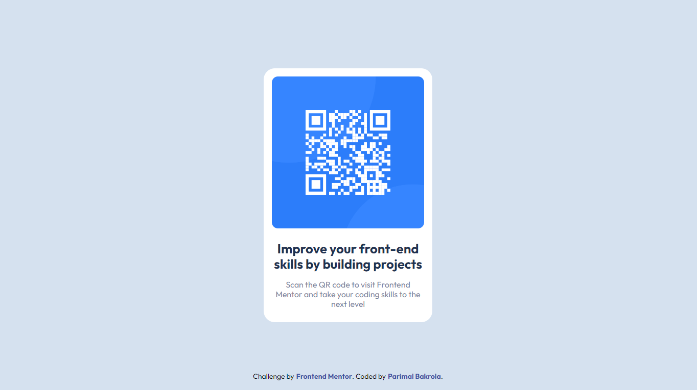

# Frontend Mentor - QR code component solution

This is a solution to the [QR code component challenge on Frontend Mentor](https://www.frontendmentor.io/challenges/qr-code-component-iux_sIO_H). Frontend Mentor challenges help you improve your coding skills by building realistic projects. 

## Table of contents

- [Overview](#overview)
  - [Screenshot](#screenshot)
  - [Links](#links)
- [My process](#my-process)
  - [Built with](#built-with)
  - [Continued development](#continued-development)
  - [Useful resources](#useful-resources)
- [Author](#author)
- [Acknowledgments](#acknowledgments)

## Overview

### Screenshot

### Links

- Solution URL: [Github](https://github.com/parimaldesign/qr-code-component-main)
- Live Site URL: [qr-code-component](https://qr-code-component-main-6gkstg2hh-parimaldesign.vercel.app/)

## My process

### Built with

- Semantic HTML5 markup
- CSS custom properties
- Flexbox
- CSS Grid
- Mobile-first workflow

### Continued development
--
## Author

- Website - [Parimal ](https://parimaldesign.github.io/)
- Frontend Mentor - [@parimaldesign](https://www.frontendmentor.io/profile/parimaldesign)

## Acknowledgments

--